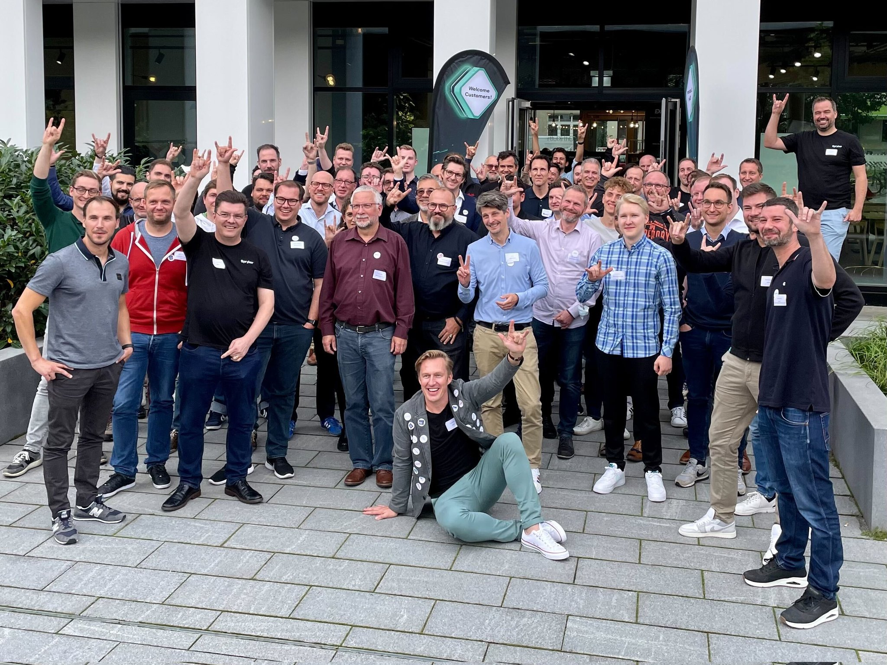

# Spryker GitHub Community

## Your place for Community Contributions

We have 3 types:

### Platform Contributions

Ecosystem-led contributions that Spryker builds into its core product (e.g. bug fixes, core improvements, and documentation updates).

### Innovation Lab

MVPs or PoC built by our ecosystem that can be developed into completely new tools/features (e.g. hackathon projects, tools, and customer & partner innovation ideas, all under MIT license)

### Commercial Contributions

"Upwork/Fiverr" for Spryker: marketplace where customers can post their feature or integration requests which community members can take on (paid).


Did you know that contributing to Spryker makes you awesome? 🤩


> We use Spryker as our e-commerce solution and customer frontend. We have very extensive product data (3 million SKUs, 8 million images, 60 million technical attributes, etc.) and a use lot of APIs. What I like best are the Code Quality, Modularity, APIs, Customer Success team and its Scalability.
>
> \
> Ricky

***

## Test

<figure><figcaption></figcaption></figure>

## Recordings

View our latest user group recording:



***

Code works as well:

```javascript
export default {
  i18n: {
    defaultLocale: 'en',
    locales: ['en', 'fr'],
  },
};
```
